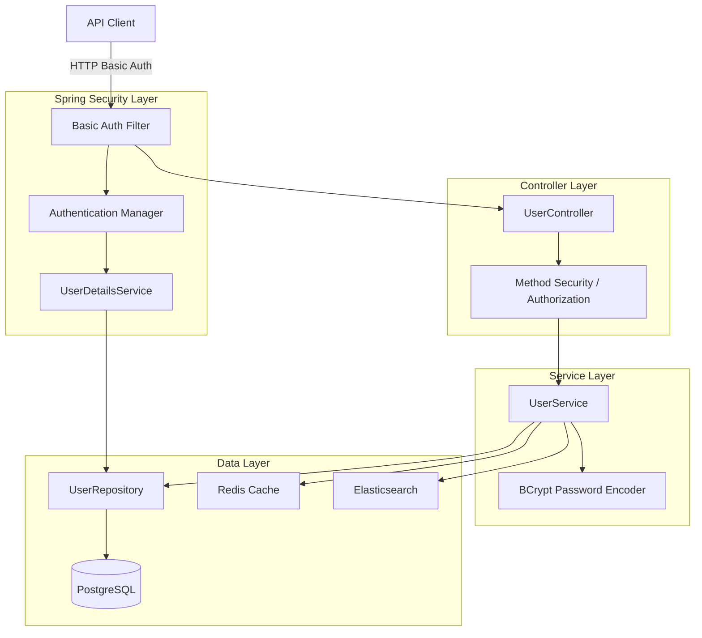
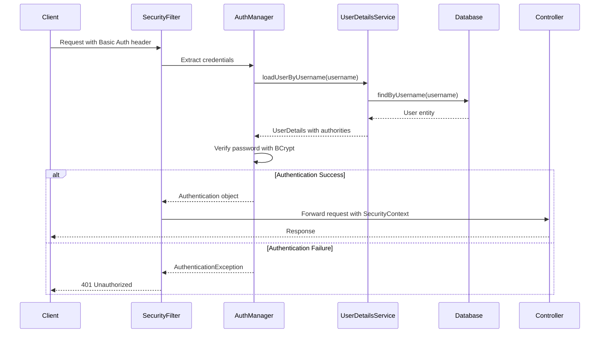
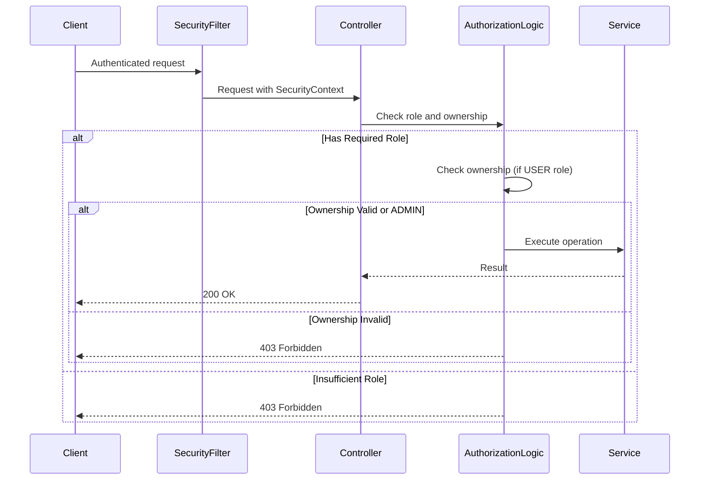

# Design Document: Role-Based Authentication and Authorization

## Overview

This design document describes the implementation of role-based authentication and authorization for the existing Spring Boot user management system. The solution uses Spring Security with HTTP Basic Authentication and BCrypt password hashing to secure API endpoints based on two roles: USER and ADMIN.

The design integrates seamlessly with existing features including PostgreSQL persistence, Redis caching, Elasticsearch indexing, and Prometheus metrics. The implementation follows Spring Security best practices and ensures backward compatibility through data migration for existing users.

## Architecture

### High-Level Architecture



### Authentication Flow



### Authorization Flow



## Components and Interfaces

### 1. User Entity Enhancement

**File:** `src/main/java/com/example/metricsdemo/model/User.java`

**New Fields:**
```java
@Column(nullable = false, unique = true)
private String username;

@Column(nullable = false)
private String password;  // BCrypt hashed

@Enumerated(EnumType.STRING)
@Column(nullable = false)
private Role role;
```

**Role Enum:**
```java
public enum Role {
    USER,
    ADMIN
}
```

**Key Methods:**
- Existing getters/setters remain unchanged
- Add getters/setters for username, password, role
- Update constructors to support authentication fields

### 2. Security Configuration

**File:** `src/main/java/com/example/metricsdemo/config/SecurityConfig.java`

**Purpose:** Configure Spring Security with Basic Auth and role-based authorization

**Key Configuration:**
```java
@Configuration
@EnableWebSecurity
@EnableMethodSecurity
public class SecurityConfig {
    
    @Bean
    public SecurityFilterChain filterChain(HttpSecurity http) {
        // Configure authorization rules:
        // - /api/users/search: permitAll (public)
        // - /api/users/{id} GET: authenticated (USER or ADMIN)
        // - /api/users/{id} PUT: authenticated (ownership check in controller)
        // - /api/users POST: hasRole("ADMIN")
        // - /api/users/{id} DELETE: hasRole("ADMIN")
        // - /api/users/{id}/role PATCH: hasRole("ADMIN")
        
        // Enable HTTP Basic Authentication
        // Disable CSRF for stateless API
        // Configure exception handling for 401/403
    }
    
    @Bean
    public PasswordEncoder passwordEncoder() {
        return new BCryptPasswordEncoder();
    }
}
```

### 3. UserDetailsService Implementation

**File:** `src/main/java/com/example/metricsdemo/security/CustomUserDetailsService.java`

**Purpose:** Load user credentials and authorities for Spring Security

**Interface:**
```java
@Service
public class CustomUserDetailsService implements UserDetailsService {
    
    @Override
    public UserDetails loadUserByUsername(String username) 
            throws UsernameNotFoundException {
        // Load user from database by username
        // Convert User entity to Spring Security UserDetails
        // Map role to GrantedAuthority
        // Return UserDetails with username, password, authorities
    }
}
```

**Responsibilities:**
- Query UserRepository by username
- Throw UsernameNotFoundException if user not found
- Build UserDetails with authorities based on role
- Return UserDetails for authentication

### 4. Controller Updates

**File:** `src/main/java/com/example/metricsdemo/controller/UserController.java`

**Endpoint Authorization Matrix:**

| Endpoint | Method | Public | USER | ADMIN | Notes |
|----------|--------|--------|------|-------|-------|
| /api/users/search | GET | ✓ | ✓ | ✓ | Public access |
| /api/users/{id} | GET | ✗ | ✓ | ✓ | View any profile |
| /api/users/{id} | PUT | ✗ | ✓* | ✓ | *USER: own profile only |
| /api/users | POST | ✗ | ✗ | ✓ | Create users |
| /api/users/{id} | DELETE | ✗ | ✗ | ✓ | Delete users |
| /api/users/{id}/role | PATCH | ✗ | ✗ | ✓ | Change roles |

**New Endpoint:**
```java
@PatchMapping("/{id}/role")
@PreAuthorize("hasRole('ADMIN')")
public ResponseEntity<User> updateUserRole(
    @PathVariable Long id,
    @RequestBody RoleUpdateRequest request) {
    // Update user role
    // Return updated user
}
```

**Ownership Validation for PUT:**
```java
@PutMapping("/{id}")
public ResponseEntity<User> updateUser(
    @PathVariable Long id,
    @RequestBody UpdateUserRequest request,
    Authentication authentication) {
    
    // Get authenticated user
    UserDetails userDetails = (UserDetails) authentication.getPrincipal();
    User authenticatedUser = userService.getUserByUsername(userDetails.getUsername());
    
    // Check if ADMIN or owner
    if (!authenticatedUser.getRole().equals(Role.ADMIN) && 
        !authenticatedUser.getId().equals(id)) {
        throw new AccessDeniedException("Can only update own profile");
    }
    
    // Prevent USER from changing their own role
    if (authenticatedUser.getRole().equals(Role.USER) && 
        request.getRole() != null && 
        !request.getRole().equals(authenticatedUser.getRole())) {
        throw new AccessDeniedException("Cannot change own role");
    }
    
    // Proceed with update
}
```

### 5. Service Layer Updates

**File:** `src/main/java/com/example/metricsdemo/service/UserService.java`

**New Methods:**
```java
public User createUserWithAuth(CreateUserRequest request) {
    // Validate username uniqueness
    // Hash password with BCrypt
    // Create user with role
    // Save to database
    // Cache in Redis (without password)
    // Index in Elasticsearch (without password/role)
    // Return created user
}

public User getUserByUsername(String username) {
    // Query by username
    // Throw exception if not found
    // Return user
}

public User updateUserRole(Long id, Role newRole) {
    // Load user
    // Update role
    // Save to database
    // Update cache
    // Return updated user
}
```

**Updated Methods:**
```java
public User createUser(User user) {
    // Hash password before saving
    // Existing logic remains
}

public User updateUser(Long id, User userDetails) {
    // If password changed, hash it
    // Existing logic remains
    // Ensure password not included in cache/search
}
```

### 6. Data Transfer Objects

**CreateUserRequest DTO:**
```java
public class CreateUserRequest {
    private String username;
    private String password;
    private String name;
    private String email;
    private Long departmentId;
    private Role role;  // Only ADMIN can set this
    
    // Validation annotations
    // Getters/setters
}
```

**UpdateUserRequest DTO:**
```java
public class UpdateUserRequest {
    private String name;
    private String email;
    private Long departmentId;
    private String password;  // Optional, only if changing
    private Role role;  // Only ADMIN can change
    
    // Validation annotations
    // Getters/setters
}
```

**UserDTO (Response):**
```java
public class UserDTO {
    private Long id;
    private String username;
    private String name;
    private String email;
    private String departmentName;
    private Role role;
    // NO password field
    
    // Getters/setters
    // Conversion from User entity
}
```

**RoleUpdateRequest DTO:**
```java
public class RoleUpdateRequest {
    private Role role;
    
    // Validation
    // Getters/setters
}
```

### 7. Repository Updates

**File:** `src/main/java/com/example/metricsdemo/repository/UserRepository.java`

**New Query Methods:**
```java
Optional<User> findByUsername(String username);
boolean existsByUsername(String username);
```

### 8. Data Initialization Updates

**File:** `src/main/java/com/example/metricsdemo/config/DataInitializer.java`

**Bootstrap Admin Creation:**
```java
private void createBootstrapAdmin() {
    if (!userRepository.existsByUsername("admin")) {
        User admin = new User();
        admin.setUsername("admin");
        admin.setPassword(passwordEncoder.encode("admin123"));
        admin.setRole(Role.ADMIN);
        admin.setName("System Administrator");
        admin.setEmail("admin@example.com");
        admin.setDepartment(/* appropriate department */);
        
        userRepository.save(admin);
        userSearchService.indexUser(admin);
        logger.info("Bootstrap admin created");
    }
}
```

**Existing User Migration:**
```java
private void migrateExistingUsers() {
    List<User> usersWithoutAuth = userRepository.findAll().stream()
        .filter(u -> u.getUsername() == null)
        .collect(Collectors.toList());
    
    for (User user : usersWithoutAuth) {
        // Generate username from email
        String baseUsername = user.getEmail().split("@")[0];
        String username = generateUniqueUsername(baseUsername);
        
        user.setUsername(username);
        user.setPassword(passwordEncoder.encode("password123"));
        user.setRole(Role.USER);
        
        userRepository.save(user);
        logger.info("Migrated user: {}", username);
    }
}

private String generateUniqueUsername(String baseUsername) {
    String username = baseUsername;
    int suffix = 1;
    
    while (userRepository.existsByUsername(username)) {
        username = baseUsername + suffix;
        suffix++;
    }
    
    return username;
}
```

### 9. Exception Handling

**New Exception Classes:**

**File:** `src/main/java/com/example/metricsdemo/exception/AccessDeniedException.java`
```java
public class AccessDeniedException extends RuntimeException {
    public AccessDeniedException(String message) {
        super(message);
    }
}
```

**Global Exception Handler Updates:**

**File:** `src/main/java/com/example/metricsdemo/exception/GlobalExceptionHandler.java`
```java
@ExceptionHandler(AccessDeniedException.class)
public ResponseEntity<ErrorResponse> handleAccessDenied(AccessDeniedException ex) {
    return ResponseEntity.status(HttpStatus.FORBIDDEN)
        .body(new ErrorResponse(ex.getMessage()));
}

@ExceptionHandler(AuthenticationException.class)
public ResponseEntity<ErrorResponse> handleAuthenticationFailure(AuthenticationException ex) {
    return ResponseEntity.status(HttpStatus.UNAUTHORIZED)
        .body(new ErrorResponse("Invalid username or password"));
}
```

### 10. Cache and Search Integration

**Redis Cache Strategy:**
- Cache User entities WITHOUT password field
- Use custom serialization to exclude password
- Maintain existing cache eviction logic

**Elasticsearch Index Strategy:**
- Index User documents WITHOUT password and role fields
- UserDocument remains unchanged (only id, name, email, department)
- Maintain existing search functionality

## Data Models

### User Entity Schema

**Database Table:** `userschema.users`

```sql
CREATE TABLE userschema.users (
    id BIGSERIAL PRIMARY KEY,
    username VARCHAR(255) NOT NULL UNIQUE,
    password VARCHAR(255) NOT NULL,
    role VARCHAR(20) NOT NULL,
    name VARCHAR(255) NOT NULL,
    email VARCHAR(255) NOT NULL UNIQUE,
    department_id BIGINT NOT NULL,
    FOREIGN KEY (department_id) REFERENCES userschema.departments(id)
);

CREATE INDEX idx_users_username ON userschema.users(username);
CREATE INDEX idx_users_role ON userschema.users(role);
```

### Role Enum

```java
public enum Role {
    USER("ROLE_USER"),
    ADMIN("ROLE_ADMIN");
    
    private final String authority;
    
    Role(String authority) {
        this.authority = authority;
    }
    
    public String getAuthority() {
        return authority;
    }
}
```

### UserDetails Mapping

```java
public class CustomUserDetails implements UserDetails {
    private final User user;
    
    public CustomUserDetails(User user) {
        this.user = user;
    }
    
    @Override
    public Collection<? extends GrantedAuthority> getAuthorities() {
        return Collections.singletonList(
            new SimpleGrantedAuthority(user.getRole().getAuthority())
        );
    }
    
    @Override
    public String getPassword() {
        return user.getPassword();
    }
    
    @Override
    public String getUsername() {
        return user.getUsername();
    }
    
    @Override
    public boolean isAccountNonExpired() { return true; }
    
    @Override
    public boolean isAccountNonLocked() { return true; }
    
    @Override
    public boolean isCredentialsNonExpired() { return true; }
    
    @Override
    public boolean isEnabled() { return true; }
}
```

## Error Handling

### Authentication Errors

**401 Unauthorized:**
- Missing Authorization header
- Invalid username
- Invalid password
- Malformed Basic Auth header

**Error Response Format:**
```json
{
    "timestamp": "2024-01-15T10:30:00Z",
    "status": 401,
    "error": "Unauthorized",
    "message": "Invalid username or password",
    "path": "/api/users/1"
}
```

### Authorization Errors

**403 Forbidden:**
- Insufficient role permissions
- Ownership validation failure
- Attempt to modify own role (USER)

**Error Response Examples:**
```json
{
    "timestamp": "2024-01-15T10:30:00Z",
    "status": 403,
    "error": "Forbidden",
    "message": "Access denied: insufficient permissions",
    "path": "/api/users"
}
```

```json
{
    "timestamp": "2024-01-15T10:30:00Z",
    "status": 403,
    "error": "Forbidden",
    "message": "Access denied: can only update own profile",
    "path": "/api/users/5"
}
```

```json
{
    "timestamp": "2024-01-15T10:30:00Z",
    "status": 403,
    "error": "Forbidden",
    "message": "Access denied: cannot change own role",
    "path": "/api/users/3"
}
```

### Validation Errors

**400 Bad Request:**
- Username already exists
- Invalid role value
- Missing required fields
- Password too weak (if validation added)

**Error Response:**
```json
{
    "timestamp": "2024-01-15T10:30:00Z",
    "status": 400,
    "error": "Bad Request",
    "message": "Username already exists",
    "path": "/api/users"
}
```

### Security Logging

All authentication and authorization failures should be logged:

```java
logger.warn("Authentication failed for username: {}", username);
logger.warn("Authorization denied for user {} attempting to access resource {}", 
    username, resourcePath);
logger.warn("Ownership validation failed: user {} attempted to modify user {}", 
    authenticatedUserId, targetUserId);
```

## Testing Strategy

### Unit Testing

Unit tests will verify specific behaviors and edge cases:

**Authentication Tests:**
- Valid credentials authenticate successfully
- Invalid username returns 401
- Invalid password returns 401
- Missing credentials returns 401
- Password hashing works correctly

**Authorization Tests:**
- ADMIN can access all endpoints
- USER can view any profile
- USER can update own profile
- USER cannot update other profiles
- USER cannot delete users
- USER cannot create users
- USER cannot change own role
- Public can search without auth

**Service Layer Tests:**
- Password encoding on user creation
- Password encoding on user update
- Username uniqueness validation
- Role assignment logic
- Ownership validation logic

**Data Migration Tests:**
- Bootstrap admin created correctly
- Existing users migrated with default credentials
- Username conflicts resolved with suffixes
- Migration idempotent (runs safely multiple times)

### Property-Based Testing

Property-based tests will verify universal correctness properties across many generated inputs. Each test will run a minimum of 100 iterations with randomized data.


## Correctness Properties

*A property is a characteristic or behavior that should hold true across all valid executions of a system—essentially, a formal statement about what the system should do. Properties serve as the bridge between human-readable specifications and machine-verifiable correctness guarantees.*

### Property Reflection

After analyzing all acceptance criteria, I identified several redundancies:
- Properties 1.2, 1.4, and 11.2 all test password hashing - consolidated into Property 1
- Properties 3.1 and 3.2 both test public search access - consolidated into Property 2
- Properties 9.3 and 11.3 both test password exclusion from responses - consolidated into Property 3
- Properties 4.2 is covered by the outcomes tested in 4.3 and 4.4
- Properties 5.6, 9.4, and 9.5 are covered by more specific permission tests
- Properties 2.5, 2.6, 8.1-8.6, and 11.1, 11.5 are implementation details, not functional requirements

The following properties represent unique, testable correctness guarantees:

### Authentication Properties

**Property 1: Password BCrypt Hashing**
*For any* user created or updated in the system, the password field stored in the database SHALL be a valid BCrypt hash (matching the pattern `$2[aby]$\d{2}$[./A-Za-z0-9]{53}`).
**Validates: Requirements 1.2, 1.4, 11.2**

**Property 2: Valid Credentials Authenticate Successfully**
*For any* user with valid credentials, when those credentials are provided via HTTP Basic Authentication, the system SHALL return a successful authentication (not 401).
**Validates: Requirements 2.1, 2.2**

**Property 3: Invalid Credentials Rejected**
*For any* user, when incorrect credentials are provided (wrong username or wrong password), the system SHALL return HTTP 401 Unauthorized.
**Validates: Requirements 2.3**

**Property 4: Protected Endpoints Require Authentication**
*For any* protected endpoint (excluding /api/users/search), when no credentials are provided, the system SHALL return HTTP 401 Unauthorized.
**Validates: Requirements 2.4**

### Authorization Properties

**Property 5: Public Search Access**
*For any* search query, when sent to GET /api/users/search without credentials, the system SHALL return search results (HTTP 200) without requiring authentication.
**Validates: Requirements 3.1, 3.2**

**Property 6: USER Can View Any Profile**
*For any* authenticated USER role and any user ID, when requesting GET /api/users/{id}, the system SHALL return the user profile (HTTP 200).
**Validates: Requirements 4.1**

**Property 7: USER Can Update Own Profile**
*For any* authenticated USER role, when updating their own profile via PUT /api/users/{id} (where id matches authenticated user's id), the system SHALL accept the update (HTTP 200).
**Validates: Requirements 4.3**

**Property 8: USER Cannot Update Other Profiles**
*For any* authenticated USER role, when attempting to update a different user's profile via PUT /api/users/{id} (where id does not match authenticated user's id), the system SHALL return HTTP 403 Forbidden.
**Validates: Requirements 4.4**

**Property 9: USER Cannot Change Own Role**
*For any* authenticated USER role, when attempting to change their own role field in an update request, the system SHALL return HTTP 403 Forbidden.
**Validates: Requirements 4.5**

**Property 10: USER Cannot Create Users**
*For any* authenticated USER role, when attempting POST /api/users, the system SHALL return HTTP 403 Forbidden.
**Validates: Requirements 4.6**

**Property 11: USER Cannot Delete Users**
*For any* authenticated USER role and any user ID, when attempting DELETE /api/users/{id}, the system SHALL return HTTP 403 Forbidden.
**Validates: Requirements 4.7**

**Property 12: USER Cannot Change Roles**
*For any* authenticated USER role and any user ID, when attempting PATCH /api/users/{id}/role, the system SHALL return HTTP 403 Forbidden.
**Validates: Requirements 4.8**

**Property 13: ADMIN Can Create Users**
*For any* authenticated ADMIN role and any valid user data, when creating a user via POST /api/users, the system SHALL create the user successfully (HTTP 200/201).
**Validates: Requirements 5.1**

**Property 14: ADMIN Can Update Any User**
*For any* authenticated ADMIN role and any user ID, when updating via PUT /api/users/{id}, the system SHALL accept the update (HTTP 200).
**Validates: Requirements 5.2**

**Property 15: ADMIN Can Delete Any User**
*For any* authenticated ADMIN role and any user ID, when deleting via DELETE /api/users/{id}, the system SHALL delete the user successfully (HTTP 200).
**Validates: Requirements 5.3**

**Property 16: ADMIN Can Change Roles**
*For any* authenticated ADMIN role, any user ID, and any valid role, when changing role via PATCH /api/users/{id}/role, the system SHALL update the role successfully (HTTP 200).
**Validates: Requirements 5.4**

**Property 17: ADMIN Can View Any Profile**
*For any* authenticated ADMIN role and any user ID, when requesting GET /api/users/{id}, the system SHALL return the user profile (HTTP 200).
**Validates: Requirements 5.5**

### Data Model Properties

**Property 18: Username Uniqueness**
*For any* two users in the system, their usernames SHALL be distinct (no duplicate usernames allowed).
**Validates: Requirements 1.1**

**Property 19: Valid Role Values**
*For any* user in the system, the role field SHALL contain only the values USER or ADMIN.
**Validates: Requirements 1.3**

**Property 20: Password Never Exposed in Responses**
*For any* API response containing user data, the response SHALL NOT include the password field or password hash.
**Validates: Requirements 9.3, 11.3**

**Property 21: Password Never Logged**
*For any* log entry generated by the system, the log SHALL NOT contain passwords or password hashes.
**Validates: Requirements 11.4**

### Bootstrap and Migration Properties

**Property 22: Bootstrap Admin Idempotency**
*For any* number of application startups, the system SHALL create at most one bootstrap admin account (running bootstrap multiple times does not create duplicates).
**Validates: Requirements 6.3**

**Property 23: Username Generation from Email**
*For any* user being migrated with email address, the generated username SHALL be the local part of the email (before @), with numeric suffixes added to resolve conflicts.
**Validates: Requirements 7.2**

**Property 24: Migrated Users Have Default Password**
*For any* user migrated without authentication fields, the user SHALL be able to authenticate with password "password123" after migration.
**Validates: Requirements 7.3**

**Property 25: Migrated Users Have USER Role**
*For any* user migrated without authentication fields, the user's role SHALL be USER after migration.
**Validates: Requirements 7.4**

**Property 26: Username Conflict Resolution**
*For any* set of users with conflicting email prefixes during migration, each SHALL receive a unique username (original or with numeric suffix).
**Validates: Requirements 7.5**

### Integration Properties

**Property 27: Cache Excludes Passwords**
*For any* user cached in Redis, the cached data SHALL NOT contain the password field.
**Validates: Requirements 12.1, 12.2**

**Property 28: Search Index Excludes Sensitive Fields**
*For any* user indexed in Elasticsearch, the indexed document SHALL NOT contain password or role fields.
**Validates: Requirements 12.3**

**Property 29: Deletion Removes from Cache and Index**
*For any* user deleted from the system, the user SHALL be removed from both Redis cache and Elasticsearch index.
**Validates: Requirements 12.4**

### Logging Properties

**Property 30: Authentication Failures Logged**
*For any* failed authentication attempt, the system SHALL produce a log entry indicating the failure.
**Validates: Requirements 10.6**

**Property 31: Authorization Failures Logged**
*For any* failed authorization attempt, the system SHALL produce a log entry indicating the failure and the attempted action.
**Validates: Requirements 10.7**


## Testing Strategy

### Dual Testing Approach

This feature requires both unit tests and property-based tests for comprehensive coverage:

- **Unit tests**: Verify specific examples, edge cases, and error conditions
- **Property tests**: Verify universal properties across all inputs through randomization

Both testing approaches are complementary and necessary. Unit tests catch concrete bugs in specific scenarios, while property tests verify general correctness across a wide range of inputs.

### Property-Based Testing Configuration

**Library Selection:** Fast-check (for JavaScript/TypeScript) or JUnit-Quickcheck (for Java)

Since this is a Spring Boot application in Java, we will use **JUnit-Quickcheck** for property-based testing.

**Configuration Requirements:**
- Minimum 100 iterations per property test (due to randomization)
- Each property test MUST reference its design document property
- Tag format: `// Feature: user-authentication, Property {number}: {property_text}`

**Example Property Test Structure:**
```java
@RunWith(JUnitQuickcheck.class)
public class AuthenticationPropertyTests {
    
    @Property(trials = 100)
    public void passwordsAreAlwaysBCryptHashed(
        @From(UserGenerator.class) User user) {
        // Feature: user-authentication, Property 1: Password BCrypt Hashing
        
        User savedUser = userService.createUser(user);
        String storedPassword = userRepository.findById(savedUser.getId())
            .get().getPassword();
        
        // BCrypt hashes match pattern $2[aby]$\d{2}$[./A-Za-z0-9]{53}
        assertTrue(storedPassword.matches("\\$2[aby]\\$\\d{2}\\$[./A-Za-z0-9]{53}"));
    }
}
```

### Unit Testing Strategy

Unit tests should focus on:

**Specific Examples:**
- Bootstrap admin has correct credentials (username="admin", password="admin123", role=ADMIN)
- Public search endpoint returns results without authentication
- Specific error messages for authentication failures
- DTO structure validation

**Edge Cases:**
- Empty username or password
- Very long usernames (boundary testing)
- Special characters in passwords
- Null values in request fields
- Concurrent user creation with same username

**Integration Points:**
- Redis cache integration (verify cached data excludes passwords)
- Elasticsearch integration (verify indexed data excludes sensitive fields)
- Database constraints (unique username enforcement)
- Spring Security filter chain execution

**Error Conditions:**
- Invalid Basic Auth header format
- Expired or malformed tokens (if JWT added later)
- Database connection failures during authentication
- Cache unavailability

### Property-Based Testing Strategy

Property tests should focus on universal correctness guarantees:

**Authentication Properties (Properties 1-4):**
- Generate random users with various credentials
- Test password hashing for all users
- Test authentication success/failure for valid/invalid credentials
- Test protected endpoint access without credentials

**Authorization Properties (Properties 5-17):**
- Generate random users with USER and ADMIN roles
- Test endpoint access for each role across all endpoints
- Test ownership validation with random user pairs
- Test role change restrictions

**Data Model Properties (Properties 18-21):**
- Generate random user sets and verify uniqueness constraints
- Generate random users and verify role enum constraints
- Generate random API responses and verify password exclusion
- Generate random operations and verify password logging exclusion

**Bootstrap and Migration Properties (Properties 22-26):**
- Test bootstrap idempotency with multiple runs
- Generate random email addresses and test username generation
- Generate random user sets and test migration logic
- Test conflict resolution with duplicate email prefixes

**Integration Properties (Properties 27-29):**
- Generate random users and verify cache/index content
- Test deletion across all storage layers

**Logging Properties (Properties 30-31):**
- Generate random authentication/authorization failures
- Verify log entries are created

### Test Data Generators

For property-based testing, we need generators for:

**User Generator:**
```java
public class UserGenerator extends Generator<User> {
    @Override
    public User generate(SourceOfRandomness random, GenerationStatus status) {
        User user = new User();
        user.setUsername(generateUsername(random));
        user.setPassword(generatePassword(random));
        user.setRole(random.nextBoolean() ? Role.USER : Role.ADMIN);
        user.setName(generateName(random));
        user.setEmail(generateEmail(random));
        user.setDepartment(generateDepartment(random));
        return user;
    }
}
```

**Credentials Generator:**
```java
public class CredentialsGenerator extends Generator<Credentials> {
    @Override
    public Credentials generate(SourceOfRandomness random, GenerationStatus status) {
        return new Credentials(
            generateUsername(random),
            generatePassword(random)
        );
    }
}
```

**Role Generator:**
```java
public class RoleGenerator extends Generator<Role> {
    @Override
    public Role generate(SourceOfRandomness random, GenerationStatus status) {
        return random.nextBoolean() ? Role.USER : Role.ADMIN;
    }
}
```

### Test Coverage Goals

**Unit Test Coverage:**
- 100% coverage of controller endpoints
- 100% coverage of service layer methods
- 100% coverage of security configuration
- 100% coverage of exception handlers

**Property Test Coverage:**
- All 31 correctness properties implemented as property tests
- Minimum 100 iterations per property test
- Edge case generators for boundary conditions

### Integration Testing

Integration tests should verify:
- End-to-end authentication flow (Basic Auth → UserDetailsService → Database)
- End-to-end authorization flow (Role check → Ownership validation → Service execution)
- Cache integration (User creation → Redis cache → Cache retrieval)
- Search integration (User creation → Elasticsearch index → Search retrieval)
- Database transaction handling (User creation → Rollback on error)

### Performance Testing

While not part of correctness properties, performance tests should verify:
- Authentication overhead is acceptable (< 100ms per request)
- BCrypt hashing performance (< 200ms per hash)
- Cache hit rate remains high (> 80%)
- Search performance not degraded by security

### Security Testing

Security-specific tests should verify:
- Timing attack resistance (BCrypt comparison time is constant)
- Password hash strength (BCrypt with 10 rounds)
- No password leakage in logs, responses, or error messages
- No SQL injection via username/password fields
- No authentication bypass via malformed requests

### Continuous Integration

All tests (unit and property-based) should run on every commit:
- Fast unit tests run first (< 30 seconds)
- Property tests run with 100 iterations (< 5 minutes)
- Integration tests run after unit tests pass (< 2 minutes)
- Security tests run nightly (comprehensive scanning)

### Test Maintenance

- Property tests should be updated when new correctness properties are added
- Generators should be enhanced to cover new edge cases discovered
- Test data should be refreshed periodically to avoid test pollution
- Flaky tests should be investigated and fixed immediately
